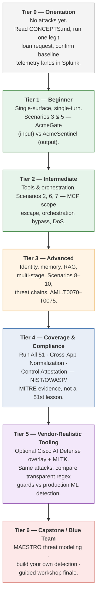

# AgentWatch Range

**A Docker-based agentic AI security range for red-teaming, runtime defense, and compliance monitoring.**

ACME Bank deployed four AI agents to speed up loan approvals. Six weeks later, their compliance officer got an email she didn't expect — not from a firewall breach, but from poisoned tool metadata and drifting session memory. This lab lets you attack that same pipeline (live Ollama LLM), see runtime controls block or allow attacks, and prove outcomes in Splunk.

[](LICENSE)
[](docker-compose.yml)
[](apps/app_runtime.py)
[](splunk_app/splunk_compliance_app/)

> **Repository:** [github.com/machowdhury/AgentwatchRange](https://github.com/machowdhury/AgentwatchRange)
> **Author:** Mahamudul Alam Chowdhury ([@machowdhury](https://github.com/machowdhury))

---

## What this gives you

Most "AI security" content is either abstract risk lists or vendor pitches. AgentWatch Range is neither — it's a working pipeline you can attack, defend, and instrument yourself, built around one purpose-driven practice: run the same attack, watch the same telemetry, get sharper each time. Whichever seat you sit in, the lab gives you something concrete to point at:

| If you're a... | This lab gives you |
|-----------------|---------------------|
| **Red teamer** | 51 MITRE ATLAS-mapped techniques — prompt injection, tool-scope escape, identity spoofing, memory poisoning, multi-stage kill chains — fired at a live 4-agent pipeline behind a real (non-canned) LLM, so attack success/failure reflects actual model behavior, not a scripted demo. |
| **Blue teamer / detection engineer** | AcmeGate/AcmeSentinel guards and workflow-surface controls (MCP, A2A, memory, orchestration) block or allow in real time; every decision lands in Splunk as OTel GenAI telemetry, so you can validate whether your detections actually fire — not assume they would. |
| **Compliance / audit** | Every technique is cross-walked to MITRE ATLAS, OWASP LLM Top 10, OWASP ASI, CSA MAESTRO, and NIST AI RMF. The Control Attestation and Technique Coverage Matrix dashboards turn "did we test for this" into a live, evidenced answer instead of a spreadsheet. |
| **Agentic security architect** | A cross-app normalization layer showing how to build one detection model across agentic apps that log differently (three deliberately mismatched telemetry schemas, one shared field set), plus an Executive AI Governance dashboard giving a CISO-readable framework-readiness score and agent-inventory risk view. |

See [docs/CONCEPTS.md](docs/CONCEPTS.md) for the full breakdown of each capability, and [docs/THREAT_SURFACES.md](docs/THREAT_SURFACES.md) for the attack-surface-by-attack-surface detail.

---

## The maturity path

The lab is built as a progression, not a pile of 51 disconnected exercises. Each tier has its own exit criteria before you move on — you don't need to finish Tier 4+ to get value, but skipping straight to "Run All 51" without Tiers 1–3 first will make the compliance evidence mean less to you.



| Tier | Focus | You'll know you're ready to move on when... |
|------|-------|-----------------------------------------------|
| **0 — Orientation** | Understand the defend path | You can explain intake → LLM → controls → OTel → Splunk without running an attack |
| **1 — Beginner** | Input vs. output inspection | You can predict, correctly, whether AcmeGate or AcmeSentinel would catch a given payload |
| **2 — Intermediate** | Tools & orchestration | You can correlate a blocked tool call to its `kill_chain.stage` in Splunk |
| **3 — Advanced** | Cross-agent trust, behavioral detection | You've traced a multi-stage `incident_id` end-to-end through the Actor Chain Story dashboard |
| **4 — Coverage & Compliance** | Evidence generation, not new lessons | You've run All 51 and can point to a live, non-attestation-only NIST/OWASP control result |
| **5 — Vendor-Realistic Tooling** | Regex guards vs. production ML | You've compared one attack's outcome under AcmeGate/AcmeSentinel *and* the Cisco overlay |
| **6 — Capstone / Blue Team** | Build, don't just consume | You've written a new detection for one of the six emerging techniques from scratch |

Full detail, per-tier SPL, and the scenario-to-tier mapping: [docs/LEARNING_PATH.md](docs/LEARNING_PATH.md).

---

## Choose your path

| Path | Go here |
|------|---------|
| **New to this? → Start Here** | [Start here — your first 30 minutes](#start-here--your-first-30-minutes) below |
| **I know Docker/Splunk → Quick Start** | [Condensed commands](#quick-start) |
| **I want the architecture → Concepts** | [docs/CONCEPTS.md](docs/CONCEPTS.md) |
| **I want a structured curriculum → Learning Path** | [docs/LEARNING_PATH.md](docs/LEARNING_PATH.md) |

---

## Start here — your first 30 minutes

You need **Docker Desktop** (or Docker Engine + Compose v2) and **~16 GB RAM** if Splunk runs locally.
Full hardware checklist: [docs/PREREQUISITES.md](docs/PREREQUISITES.md)

### Step 1 — Get the code and start containers (~5–15 min)

```bash
git clone https://github.com/machowdhury/AgentwatchRange.git
cd AgentwatchRange
cp .env.example .env
docker compose --profile local up --build -d
```

> **Tip:** `.env.example` sets `COMPOSE_PROFILES=local` so plain `docker compose up` works after `cp .env.example .env`. On older clones, always pass `--profile local`.

> **Before you go further:** `.env.example` ships with a public, documented default password (`SPLUNK_PASSWORD`) and HEC token (`SPLUNK_HEC_TOKEN`) — that's intentional, they're meant to make `localhost` setup frictionless. They are **not** meant to be exposed. If you follow [docs/CLOUD_VM_DEPLOYMENT.md](docs/CLOUD_VM_DEPLOYMENT.md) to run this on a reachable server, change both values in `.env` *before* opening any port beyond your VPN.

Wait for Ollama to pull the model (first boot only, ~1.3 GB):

```bash
docker compose --profile local logs -f ollama    # Ctrl+C when llama3.2:1b appears
docker compose --profile local ps              # all services running / healthy
```

**Optional:** check one-shot HEC init — `docker logs acme_splunk_hec_init` should end with `PASS — HEC returned HTTP 200`. If it failed, Step 2 fixes it.

### Step 2 — Install Splunk apps and verify HEC (~5 min)

Splunk UI starts without the compliance app or custom index. Run once:

```bash
chmod +x scripts/package_splunk_app.sh scripts/splunk_install_apps.sh scripts/splunk_local_bootstrap.sh
./scripts/package_splunk_app.sh
./scripts/splunk_install_apps.sh      # compliance app + MLTK
./scripts/splunk_local_bootstrap.sh   # index + HEC token (safe to re-run)
docker compose --profile local restart otel_collector
```

**Pass:** bootstrap prints `HEC returned HTTP 200`.

Quick terminal check:

```bash
curl -s -o /dev/null -w "HEC HTTP %{http_code}\n" \
  http://localhost:8088/services/collector/event \
  -H "Authorization: Splunk acme-hec-token-0000-1111-2222-3333" \
  -d '{"event":{"install_test":true}}'
```

Expected: `HEC HTTP 200` (not `000`).

### Step 3 — Open the lab and check status

| App | URL (local) | Cloud VM / Splunk SaaS | You should see |
|-----|-------------|------------------------|----------------|
| **Attack Panel** | http://localhost:5001 | `http://<VM-PUBLIC-IP>:5001` — lab VM public or VPN IP ([Pattern A/B](docs/CLOUD_VM_DEPLOYMENT.md)) | Header: **TARGET ONLINE** + **LLM ONLINE** (green) |
| **Banking app** | http://localhost:5000 | `http://<VM-PUBLIC-IP>:5000` — same lab VM as Attack Panel | Loan pipeline UI loads |
| **Splunk** | http://localhost:8000 | **Same VM (Pattern A):** `http://<VM-PUBLIC-IP>:8000` (use HTTPS in production). **Splunk Cloud (Pattern B):** your tenant URL, e.g. `https://<stack>.splunkcloud.com` — hunts run in Splunk Cloud; lab VM only serves `:5000`/`:5001` | Login: `admin` / password from `.env` (default `ACMEPassword2026!` — see the credential note in Step 1). Splunk Cloud: your org login, not the lab `.env` password |

> **Cloud VM:** Replace `<VM-PUBLIC-IP>` with your instance's public or VPN-reachable address. Restrict `:5000`, `:5001`, and `:8000` to learner/admin CIDRs — never `0.0.0.0/0`. Change default Splunk password and HEC token in `.env` before opening ports. Full firewall patterns: [docs/CLOUD_VM_DEPLOYMENT.md](docs/CLOUD_VM_DEPLOYMENT.md).

Attack Panel tabs (left to right): **Top 10 Scenarios** (default) → All 51 → Threat Chains → Custom → **Workshop** (last).

### Step 4 — Verify telemetry before any attack (~3 min)

**Do this before firing scenarios.** You want proof that **benign** traffic reaches Splunk — then attacks are easy to spot.

**Option A — Automatic baseline (easiest)**

The banking app sends harmless loan requests every 90–240 seconds once Ollama is healthy.

1. Wait **2–3 minutes** after stack startup.
2. Check the simulator: `curl -s http://localhost:5000/api/v1/traffic/status` — `"running": true`, `ticks_ok` increasing.
3. In Splunk **Search**:

```spl
index=acme_agentic_telemetry earliest=-15m
| stats count by testbed_mode
```

**Pass:** `count` ≥ 1. Often you see `BASELINE_TRAFFIC` (automatic) and/or `BANKING_LIVE` (manual UI).

**Option B — One manual loan (recommended first time)**

1. Open http://localhost:5000
2. Enter a normal message, for example:

   ```text
   I would like to apply for a small business loan. Annual revenue is $250,000.
   ```

3. Click **Run Through All Agents**
4. Click **↺ Refresh Sessions** — pipeline history should show your request
5. Wait **30–60 seconds**, then in Splunk:

```spl
index=acme_agentic_telemetry earliest=-15m
| stats count by testbed_mode gen_ai.agent.name
```

**Pass:** count > 0; agents such as `acme-agent-intake-001` appear.

> **Not zero?** Re-run `./scripts/splunk_local_bootstrap.sh`, restart OTel, wait another minute. See [Verification & Troubleshooting](docs/REFERENCE.md#verification--troubleshooting).

### Step 5 — Run your first attack (~5 min)

Only after Step 4 shows events in Splunk.

1. Open http://localhost:5001
2. Click the **Workshop** tab (last tab)
3. Click **RUN FIRST WIN PATH**
4. Wait for the path to finish (Scenarios 6 → 5 → 9)

### Step 6 — Prove the attack in Splunk (~2 min)

Wait **60 seconds**, then in Splunk **Search**:

```spl
index=acme_agentic_telemetry sourcetype="otel:agentic:json" earliest=-15m
| stats count by campaign_week
```

**Pass:** `count` increased vs Step 4 and you see scenario numbers (e.g. `6`, `5`, `9`).

To separate attacks from baseline noise:

```spl
index=acme_agentic_telemetry earliest=-15m NOT testbed_mode=BASELINE_TRAFFIC
| stats count by campaign_week
```

Open **GenAI Compliance Monitor → Overview** — event count should be non-zero.

### Step 7 — You're done with the basics

You have a working **baseline → attack → telemetry → Splunk** loop — that's Tier 0 complete. Pick your next stop in [the maturity path](#the-maturity-path) above, or jump into the table below.

**Stuck?** [Verification & Troubleshooting](docs/REFERENCE.md#verification--troubleshooting) · HEC `000` or OTel `connection reset` on 8088 → `./scripts/splunk_local_bootstrap.sh`

---

## Quick Start

For experienced operators — same flow as [Start here](#start-here--your-first-30-minutes):

```bash
git clone https://github.com/machowdhury/AgentwatchRange.git && cd AgentwatchRange
cp .env.example .env
docker compose --profile local up --build -d
./scripts/package_splunk_app.sh && ./scripts/splunk_install_apps.sh && ./scripts/splunk_local_bootstrap.sh
docker compose --profile local restart otel_collector
```

Then: http://localhost:5001 → **Workshop** → **RUN FIRST WIN PATH** → Splunk Search (Step 6 above).

| URL | Role |
|-----|------|
| http://localhost:5001 | Attack Panel |
| http://localhost:5000 | Banking app (defend path) |
| http://localhost:8000 | Splunk (monitor) |

Cloud VM: replace `localhost` with your server IP, and change the default Splunk password / HEC token first — see [Deployment options](#deployment-options-local-self-hosted-or-splunk-cloud) below and [docs/CLOUD_VM_DEPLOYMENT.md](docs/CLOUD_VM_DEPLOYMENT.md).

---

## Deployment options: local, self-hosted, or Splunk Cloud

The telemetry pipeline (OTel Collector → Splunk HEC) works the same regardless of where Splunk itself lives. Pick the pattern that matches your setup — switching later is a `.env` + compose-file change, not a rebuild:

| Where Splunk runs | How to run it | `.env` setting |
|---|---|---|
| **Local Docker container** (default) | `docker compose --profile local up -d` — Splunk ships as part of the stack | `SPLUNK_MODE=local` |
| **Self-hosted Splunk Enterprise** — your own VM on AWS EC2 / GCP Compute / Azure VM, or on-prem | `docker compose -f docker-compose.yml -f docker-compose.external.yml up -d` — the lab containers ship telemetry to your existing Splunk instance over HEC; no local Splunk container starts | `SPLUNK_MODE=external`, `SPLUNK_HEC_ENDPOINT` pointed at your Splunk host |
| **Splunk Cloud (SaaS)** | Same `docker-compose.external.yml` override, pointed at your Splunk Cloud stack's HEC URL instead of a self-hosted host | `SPLUNK_MODE=external`, `SPLUNK_HEC_ENDPOINT=https://http-inputs-<stack>.splunkcloud.com:443/...`, `SPLUNK_HEC_TLS_SKIP_VERIFY=false` |

If you're also running the lab containers themselves (banking app, Attack Panel, Ollama) on a cloud VM rather than your laptop, here's the minimum firewall / security-group posture — **never expose Splunk, HEC, or Ollama to the open internet**:

| Port | What | Open to |
|---|---|---|
| 5000 | Banking app | Your learner/demo IP range or VPN CIDR — never `0.0.0.0/0` |
| 5001 | Attack Panel | Same as above |
| 22 | SSH | Your admin IP or bastion subnet only |
| 8000 | Splunk Web UI — only if Splunk runs on the same VM | Admin/learner IP range or VPN — never public |
| 8088 | Splunk HEC (ingest) | **Do not open inbound to the internet.** Same VPC/subnet only if Splunk runs on a separate cloud VM; not needed at all with Splunk Cloud |
| 443 (outbound) | HEC to Splunk Cloud, Docker image pulls, Ollama model download | Allow egress |
| 11434, 4317, 4318, 8889 | Ollama API, OTel Collector (gRPC/HTTP/metrics) | **Never expose** — internal/VPC-only |

Full per-provider walkthroughs (AWS EC2, Azure VM, GCP Compute — actual security-group/NSG/firewall-rule commands) and the three deployment patterns (all-in-one VM, lab VM + external Splunk, dedicated Splunk VM) are in [docs/CLOUD_VM_DEPLOYMENT.md](docs/CLOUD_VM_DEPLOYMENT.md) — this section is the summary; that doc is the reference.

---

## Tech stack & dependencies

What's actually running, and what's optional.

### Core stack (always running)

| Component | What it is | Version / image |
|---|---|---|
| Docker Compose | Orchestrates every service | Compose v2 |
| Python | Banking app + Attack Panel runtime | 3.11-slim |
| Flask | Web framework for both apps | 3.0.3 |
| Ollama | Local LLM runtime | `ollama/ollama:latest`, model `llama3.2:1b` |
| OpenTelemetry | GenAI semantic-convention instrumentation — traces, metrics, logs | SDK/API 1.24.0, semconv 0.45b0 |
| OpenTelemetry Collector | Receives OTLP, batches, exports to Splunk HEC | `otel/opentelemetry-collector-contrib:0.96.0` |
| Splunk | SIEM — compliance dashboards, HEC ingestion | `splunk/splunk:9.2.1` (local container), or your own Splunk Enterprise/Cloud — see [Deployment options](#deployment-options-local-self-hosted-or-splunk-cloud) |
| requests, python-dotenv, PyYAML | HTTP client, config loading | pinned in [`apps/requirements.txt`](apps/requirements.txt) |

### Optional: Cisco AI Defense overlay (`docker-compose.cisco.yml`)

| Component | What it is | Real or lab-original? |
|---|---|---|
| Cisco AI Defense platform | Commercial scanning platform | Real, commercial |
| Foundation-Sec-8B | Security-tuned LLM, served via Ollama | Real, [Hugging Face](https://huggingface.co/fdtn-ai/Foundation-Sec-8B) |
| Cisco Time Series Model (CTSM) | Splunk MLTK anomaly-detection app | Real, [splunk/cisco-time-series-model](https://github.com/splunk/cisco-time-series-model) |
| MCP Scanner, AIBOM | Real Cisco open-source CLIs — installable today via `apps/requirements-cisco.txt` / `scripts/install_cisco_tools.sh` | Real, Apache-2.0 |
| DefenseClaw, Skill Scanner | Real Cisco open-source tools, referenced in [docs/CISCO_INTEGRATION.md](docs/CISCO_INTEGRATION.md) | Real, Apache-2.0 — not yet wired into this repo's install scripts |

### Optional: CSA MAESTRO workshop

External Node.js threat-modeling app, run separately from Docker Compose — see [docs/MAESTRO_WORKSHOP.md](docs/MAESTRO_WORKSHOP.md).

### Lab-original (not third-party)

**AcmeGate** and **AcmeSentinel** (regex input/output guards) and the synthetic vendor-style and third-party telemetry schemas are this project's own code — not affiliated with any vendor.

Full license table and attribution: [NOTICE.md](NOTICE.md).

---

## What to read next

| Read this | When |
|-----------|------|
| **[docs/CONCEPTS.md](docs/CONCEPTS.md)** | Architecture, containers, AcmeGate/AcmeSentinel transparency, limitations |
| **[docs/LEARNING_PATH.md](docs/LEARNING_PATH.md)** | Full Tier 0–6 curriculum, per-tier SPL, scenario-to-tier map |
| **[docs/REFERENCE.md](docs/REFERENCE.md)** | Env vars, credentials, API curl examples, install detail, troubleshooting |
| **[docs/USER_GUIDE.md](docs/USER_GUIDE.md)** | Workshop buttons, SPL queries, dashboards, maturity lifecycle |
| **[docs/ATTACK_PANEL_GUIDE.md](docs/ATTACK_PANEL_GUIDE.md)** | Every Attack Panel tab — outcomes, per-scenario SPL |
| **[docs/EXERCISE_RUNNER.md](docs/EXERCISE_RUNNER.md)** | Guided, one-technique-at-a-time Splunk practice dashboard |
| **[docs/EXECUTIVE_GOVERNANCE.md](docs/EXECUTIVE_GOVERNANCE.md)** | CISO / audit posture dashboard — framework readiness, portfolio risk |
| **[docs/WORKSHOP.md](docs/WORKSHOP.md)** | Full curriculum, hunt questions Q101–Q509, facilitator runbook |
| **[docs/PREREQUISITES.md](docs/PREREQUISITES.md)** | Docker install, permissions, Splunk checklist |
| **[docs/THREAT_SURFACES.md](docs/THREAT_SURFACES.md)** | Agentic attack surfaces → Scenario 1–10 + emerging techniques |
| **[docs/MAESTRO_WORKSHOP.md](docs/MAESTRO_WORKSHOP.md)** | CSA MAESTRO threat modeling path |
| **[docs/CISCO_INTEGRATION.md](docs/CISCO_INTEGRATION.md)** | Optional Cisco AI Defense overlay + MLTK, plus reference notes on Cisco's real open-source AI security tools (DefenseClaw, MCP Scanner, Skill Scanner) |
| **[docs/CLOUD_VM_DEPLOYMENT.md](docs/CLOUD_VM_DEPLOYMENT.md)** | Running on AWS/GCP/Azure — firewall rules, deployment patterns, per-provider setup |
| **[splunk_app/INSTALL.md](splunk_app/INSTALL.md)** | Splunk Cloud / Enterprise app upload |

---

## License & Attribution

AgentWatch Range Lab — Principal DevSecOps Systems Engineering range for agentic AI security validation.

**Third-party / reference names:** AcmeGate and AcmeSentinel are **lab-original** Python middleware, unaffiliated with any vendor product. The optional [Cisco AI Defense overlay](docs/CISCO_INTEGRATION.md) (commercial platform, Foundation-Sec-8B, Cisco Time Series Model) uses real third-party tools when enabled; that same doc also references Cisco's real open-source AI security tools — **DefenseClaw**, **MCP Scanner**, **Skill Scanner** ([github.com/cisco-ai-defense](https://github.com/cisco-ai-defense), Apache-2.0) — not yet embedded in this lab. Splunk and Ollama run as described in their respective containers/images. "AgentWatch Range" is this project's own name and is unrelated to any similarly-named third-party tool or framework. See [NOTICE.md](NOTICE.md).

MIT License — see [LICENSE](LICENSE).
